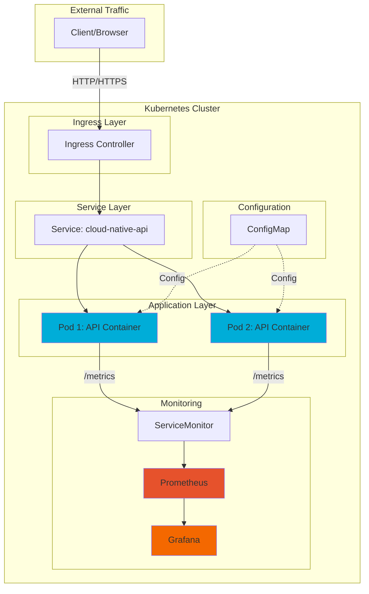

# ☁️ Cloud-Native Microservice Platform

A production-ready cloud-native microservice built with Go, containerized with Docker, orchestrated with Kubernetes, and monitored with Prometheus & Grafana.


## 📋 Table of Contents

- [Overview](#overview)
- [Architecture](#architecture)
- [Features](#features)
- [Prerequisites](#prerequisites)
- [Quick Start](#quick-start)
- [Local Development](#local-development)
- [Docker Deployment](#docker-deployment)
- [Kubernetes Deployment](#kubernetes-deployment)
- [Helm Deployment](#helm-deployment)
- [Monitoring](#monitoring)
- [API Endpoints](#api-endpoints)
- [Project Structure](#project-structure)
- [CI/CD Pipeline](#cicd-pipeline)
- [Testing](#testing)
- [Contributing](#contributing)
- [License](#license)

## 🎯 Overview

This project demonstrates a complete cloud-native microservice implementation following industry best practices. It showcases:

- **Microservice Architecture**: RESTful API design with health checks and observability
- **Containerization**: Multi-stage Docker builds with security hardening
- **Orchestration**: Kubernetes deployments with proper resource management
- **Package Management**: Helm charts for easy deployment and configuration
- **Observability**: Prometheus metrics and Grafana dashboards
- **CI/CD**: Automated testing, building, and deployment via GitHub Actions

## 🏗️ Architecture



### Component Interaction

1. **Client Layer**: External users/applications
2. **Ingress**: Routes external traffic to internal services
3. **Service**: Load balances traffic across pods
4. **Pods**: Run containerized Go application
5. **ConfigMap**: Provides configuration to pods
6. **Monitoring**: Prometheus scrapes metrics, Grafana visualizes

## ✨ Features

### Core Functionality
- ✅ RESTful API with health, readiness, and metrics endpoints
- ✅ Graceful shutdown handling
- ✅ Structured logging middleware
- ✅ Environment-based configuration

### Containerization
- ✅ Multi-stage Docker build for optimized images
- ✅ Alpine-based final image (~15MB)
- ✅ Non-root user execution
- ✅ Built-in health checks

### Kubernetes
- ✅ Production-ready deployment manifests
- ✅ Resource requests and limits
- ✅ Liveness and readiness probes
- ✅ ConfigMap for configuration management
- ✅ Security contexts and best practices

### Helm
- ✅ Parameterized chart for easy customization
- ✅ Configurable values for all aspects
- ✅ ServiceMonitor integration
- ✅ Helper templates for consistency

### Observability
- ✅ Prometheus metrics integration
- ✅ Custom application metrics
- ✅ HTTP request metrics (rate, duration, in-flight)
- ✅ Grafana dashboard template

### CI/CD
- ✅ Automated testing pipeline
- ✅ Docker image building and pushing
- ✅ Code linting and formatting checks
- ✅ Security vulnerability scanning

## 📦 Prerequisites

Before you begin, ensure you have the following installed:

- **Go** 1.21 or higher - [Install Go](https://golang.org/doc/install)
- **Docker** 20.10+ - [Install Docker](https://docs.docker.com/get-docker/)
- **Kubernetes** (Minikube or kind) - [Install Minikube](https://minikube.sigs.k8s.io/docs/start/)
- **kubectl** - [Install kubectl](https://kubernetes.io/docs/tasks/tools/)
- **Helm** 3.0+ - [Install Helm](https://helm.sh/docs/intro/install/)
- **Make** (optional) - For using Makefile commands

## 🚀 Quick Start

### 1. Clone the Repository

```bash
git clone https://github.com/SumaReddy369/cloud-native-microservice.git
cd cloud-native-microservice
```

### 2. Run Locally

```bash
# Download dependencies
go mod download

# Run the application
go run ./cmd/api

# Or use Make
make run
```

### 3. Test the API

```bash
# Health check
curl http://localhost:8080/health

# Readiness check
curl http://localhost:8080/ready

# Prometheus metrics
curl http://localhost:8080/metrics
```

## 💻 Local Development

### Build the Application

```bash
# Build binary
go build -o bin/api ./cmd/api

# Or use Make
make build
```

### Run Tests

```bash
# Run all tests
go test -v ./...

# Run with coverage
go test -v -race -coverprofile=coverage.txt ./...

# Or use Make
make test
```

### Code Quality

```bash
# Format code
make fmt

# Run linter
make lint

# Run go vet
make vet
```

## 🐳 Docker Deployment

### Build Docker Image

```bash
# Build image
docker build -t sumareddy369/cloud-native-api:latest .

# Or use Make
make docker-build
```

### Run Docker Container

```bash
# Run container
docker run -p 8080:8080 sumareddy369/cloud-native-api:latest

# Or use Make
make docker-run
```

### Push to Docker Hub

```bash
# Login to Docker Hub
docker login

# Push image
docker push sumareddy369/cloud-native-api:latest

# Or use Make
make docker-push
```

## ☸️ Kubernetes Deployment

### Prerequisites

Start Minikube:

```bash
minikube start --cpus=4 --memory=8192
```

### Deploy with kubectl

```bash
# Deploy all resources
kubectl apply -f k8s/

# Or use Make
make k8s-deploy

# Verify deployment
kubectl get all -n cloud-native

# Check pod status
kubectl get pods -n cloud-native -w
```

### Access the Application

```bash
# Port forward to access locally
kubectl port-forward -n cloud-native svc/cloud-native-api 8080:80

# In another terminal, test endpoints
curl http://localhost:8080/health
curl http://localhost:8080/ready
curl http://localhost:8080/metrics
```

### View Logs

```bash
# Get pod logs
kubectl logs -n cloud-native -l app=cloud-native-api -f

# Describe pod for troubleshooting
kubectl describe pod -n cloud-native -l app=cloud-native-api
```

### Cleanup

```bash
# Delete all resources
kubectl delete -f k8s/

# Or use Make
make k8s-delete
```

## ⎈ Helm Deployment

### Install with Helm

```bash
# Install the chart
helm install my-api ./helm/cloud-native-api --namespace cloud-native --create-namespace

# Or use Make
make helm-install

# Verify installation
helm list -n cloud-native
```

### Customize Installation

```bash
# Override values
helm install my-api ./helm/cloud-native-api \
  --namespace cloud-native \
  --create-namespace \
  --set replicaCount=3 \
  --set image.tag=v1.0.0 \
  --set resources.requests.cpu=200m
```

### Upgrade Release

```bash
# Upgrade with new values
helm upgrade my-api ./helm/cloud-native-api \
  --namespace cloud-native \
  --set replicaCount=4

# Or use Make
make helm-upgrade
```

### Uninstall

```bash
# Uninstall release
helm uninstall my-api --namespace cloud-native

# Or use Make
make helm-uninstall
```

## 📊 Monitoring

### Install Prometheus & Grafana (using kube-prometheus-stack)

```bash
# Add Helm repository
helm repo add prometheus-community https://prometheus-community.github.io/helm-charts
helm repo update

# Install Prometheus stack
helm install prometheus prometheus-community/kube-prometheus-stack \
  --namespace monitoring \
  --create-namespace

# Wait for pods to be ready
kubectl wait --for=condition=ready pod -l app.kubernetes.io/name=prometheus -n monitoring --timeout=300s
```

### Apply ServiceMonitor

```bash
# Apply ServiceMonitor for your application
kubectl apply -f monitoring/prometheus-servicemonitor.yaml
```

### Access Prometheus

```bash
# Port forward Prometheus
kubectl port-forward -n monitoring svc/prometheus-kube-prometheus-prometheus 9090:9090

# Open browser: http://localhost:9090
```

### Access Grafana

```bash
# Port forward Grafana
kubectl port-forward -n monitoring svc/prometheus-grafana 3000:80

# Get Grafana admin password
kubectl get secret -n monitoring prometheus-grafana -o jsonpath="{.data.admin-password}" | base64 --decode

# Open browser: http://localhost:3000
# Username: admin
# Password: (from above command)
```

### Import Dashboard

1. Open Grafana at http://localhost:3000
2. Login with admin credentials
3. Navigate to **Dashboards** → **Import**
4. Upload `monitoring/grafana-dashboard.json`
5. Select Prometheus data source
6. Click **Import**

### Sample Grafana Dashboard


*Replace with actual screenshot after deployment*

### Key Metrics to Monitor

- **Request Rate**: `rate(http_requests_total[5m])`
- **Request Duration (p95)**: `histogram_quantile(0.95, rate(http_request_duration_seconds_bucket[5m]))`
- **Requests In Flight**: `http_requests_in_flight`
- **Error Rate**: `rate(http_requests_total{status=~"5.."}[5m])`

## 🔌 API Endpoints

### Health Check
```bash
GET /health
```

**Response:**
```json
{
  "status": "healthy",
  "timestamp": "2026-01-28T10:30:00Z",
  "uptime": "2h15m30s",
  "version": "1.0.0"
}
```

### Readiness Check
```bash
GET /ready
```

**Response:**
```json
{
  "ready": true,
  "timestamp": "2026-01-28T10:30:00Z"
}
```

### Prometheus Metrics
```bash
GET /metrics
```

**Response:**
```
# HELP http_requests_total Total number of HTTP requests
# TYPE http_requests_total counter
http_requests_total{endpoint="/health",method="GET",status="200"} 150

# HELP http_request_duration_seconds HTTP request duration in seconds
# TYPE http_request_duration_seconds histogram
http_request_duration_seconds_bucket{endpoint="/health",method="GET",le="0.005"} 120
...
```

## 📂 Project Structure

```
cloud-native-microservice/
├── .github/
│   └── workflows/
│       └── ci.yml                 # GitHub Actions CI/CD pipeline
├── cmd/
│   └── api/
│       └── main.go                # Application entry point
├── internal/
│   ├── api/
│   │   ├── router.go              # Router setup (testable)
│   │   └── router_test.go         # API integration tests
│   ├── handlers/
│   │   ├── handlers.go            # HTTP handlers
│   │   └── handlers_test.go       # Handler unit tests
│   └── metrics/
│       ├── metrics.go             # Prometheus metrics
│       └── metrics_test.go        # Metrics unit tests
├── k8s/
│   ├── namespace.yaml             # Kubernetes namespace
│   ├── configmap.yaml             # Application configuration
│   ├── deployment.yaml            # Deployment manifest
│   └── service.yaml               # Service manifest
├── helm/
│   └── cloud-native-api/
│       ├── Chart.yaml             # Helm chart metadata
│       ├── values.yaml            # Default values
│       └── templates/
│           ├── _helpers.tpl       # Template helpers
│           ├── deployment.yaml    # Deployment template
│           ├── service.yaml       # Service template
│           ├── configmap.yaml     # ConfigMap template
│           ├── servicemonitor.yaml# ServiceMonitor template
│           └── NOTES.txt          # Installation notes
├── monitoring/
│   ├── prometheus-servicemonitor.yaml  # Prometheus ServiceMonitor
│   └── grafana-dashboard.json          # Grafana dashboard
├── .gitignore                     # Git ignore rules
├── Dockerfile                     # Multi-stage Docker build
├── Makefile                       # Build automation
├── go.mod                         # Go module definition
├── go.sum                         # Go module checksums
├── README.md                      # This file
└── LICENSE                        # MIT License
```

## 🔄 CI/CD Pipeline

The project includes a complete GitHub Actions workflow that:

### Test Stage
- Sets up Go environment
- Downloads and verifies dependencies
- Runs `go vet` for static analysis
- Runs unit and integration tests with race detector and coverage
- Checks code formatting with `go fmt`
- Runs `golangci-lint` for comprehensive linting
- Builds the application

### Build Stage
- Builds Docker image using BuildKit
- Pushes image to Docker Hub
- Tags with branch name, commit SHA, and latest
- Uses layer caching for faster builds

### Security Stage
- Scans Docker image with Trivy
- Uploads results to GitHub Security

### Setup GitHub Actions

1. Add secrets to your repository:
   - `DOCKER_USERNAME`: Your Docker Hub username
   - `DOCKER_PASSWORD`: Your Docker Hub password/token

2. Push to main branch to trigger the pipeline:
   ```bash
   git add .
   git commit -m "Initial commit"
   git push origin main
   ```

### Verify Before Pushing

Run the verification script to ensure all checks pass locally:

```bash
# Windows (PowerShell)
.\scripts\verify.ps1

# Linux/macOS
./scripts/verify.sh
```

This runs tests, build, go vet, format check, and Docker build.

## 🧪 Testing

The project includes comprehensive unit and integration tests:

- **Handler tests** (`internal/handlers/`): Health and readiness endpoint behavior
- **Metrics tests** (`internal/metrics/`): Prometheus middleware and metrics collection
- **API integration tests** (`internal/api/`): Full HTTP stack for all endpoints

### Run All Tests

```bash
# Run tests with race detector and coverage
make test

# Or directly
go test -v -race -coverprofile=coverage.txt -covermode=atomic ./...
```

### Manual Testing

```bash
# Test health endpoint
curl -i http://localhost:8080/health

# Test readiness endpoint
curl -i http://localhost:8080/ready

# Test metrics endpoint
curl -i http://localhost:8080/metrics

# Load test with Apache Bench
ab -n 1000 -c 10 http://localhost:8080/health
```

## 🤝 Contributing

Contributions are welcome! Please feel free to submit a Pull Request.

1. Fork the repository
2. Create your feature branch (`git checkout -b feature/amazing-feature`)
3. Commit your changes (`git commit -m 'Add some amazing feature'`)
4. Push to the branch (`git push origin feature/amazing-feature`)
5. Open a Pull Request

## 📄 License

This project is licensed under the MIT License - see the [LICENSE](LICENSE) file for details.

## 🙏 Acknowledgments

- [Gorilla Mux](https://github.com/gorilla/mux) - HTTP router
- [Prometheus Client](https://github.com/prometheus/client_golang) - Metrics library
- [Kubernetes](https://kubernetes.io/) - Container orchestration
- [Helm](https://helm.sh/) - Package manager for Kubernetes
- [Docker](https://www.docker.com/) - Containerization platform

## 📧 Contact

Suma Reddy - [@SumaReddy369](https://github.com/SumaReddy369)

Project Link: [https://github.com/SumaReddy369/cloud-native-microservice](https://github.com/SumaReddy369/cloud-native-microservice)

---

**Built with ❤️ using Go, Kubernetes, and Cloud-Native technologies**